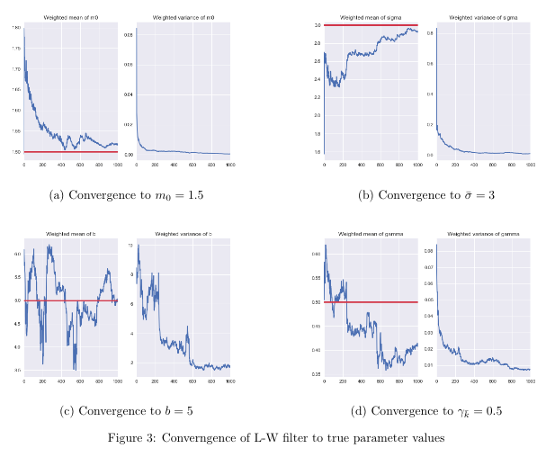
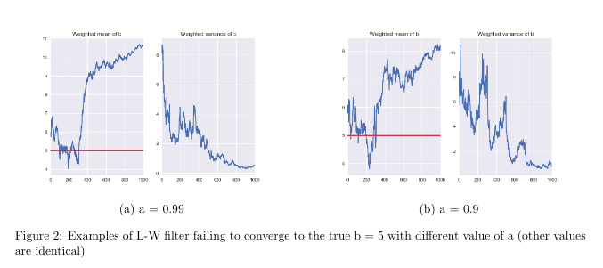

# MSM_python

## Description
Python codes running Liu and West filter on Markov Switching Multifractal Model (MSM) developed by Jan, Jae and Kancheng.

For detailed theoretical description of the algorithm and the model as well as toy data examples, see **Project_report_Jan,Jae,KC_.pdf**.

## Some cool figures

